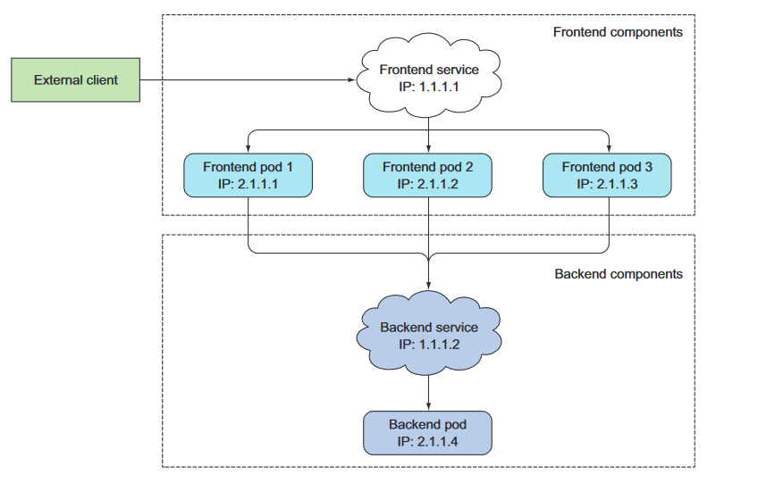
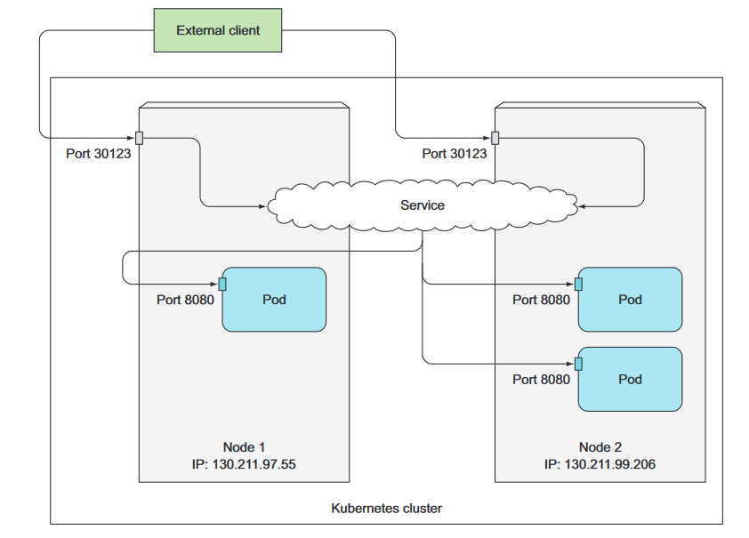
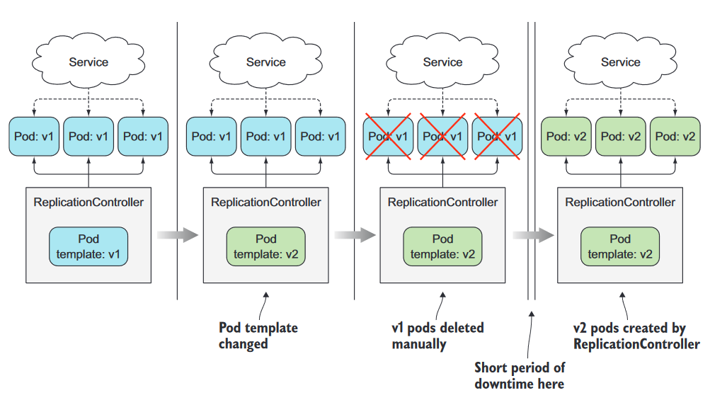
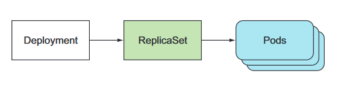
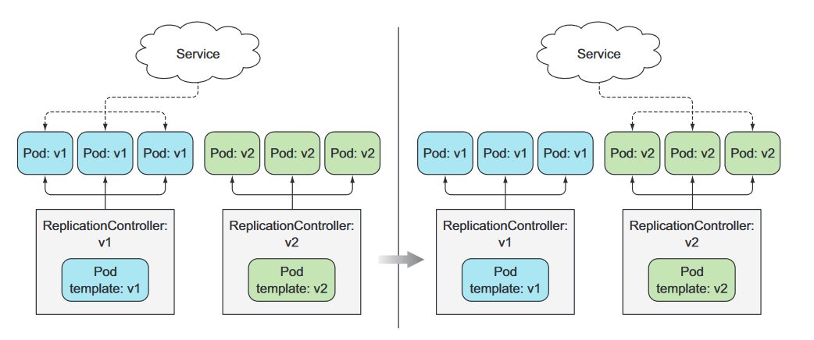

# Projecte final de grau superior d'ASIX


---
---
## Introducció a Kubernetes 

### Què és Kubernetes?  
  
Kubernetes és un sistema de *software* de codi obert que serveix per a automatitzar la implementació i gestió de sistemes d'aplicació complexos a gran escala, compostos per processos informàtics que s'executen en *contaniers*.  
  
Kubernetes permet executar aplicacions de *software* en milers de nodes d'ordinadors  
com si tots aquests nodes fossin un de molt gra. Això permet que s'abstregui la infraestructura subjacent i fent que se simplifiqui el desenvolupament, el desplegament i la gestió.

### Quin és l'origen de Kubernetes?  
  
Kubernetes va ser desenvolupat originalment per Google, que sempre ha executat  
aplicacions en contenidors. Ja en 2014 van dir que llançaven 2.000 milions de contenidors cada setmana. Això és més de 3.000 contenidors per segon, i la xifra és molt  
més alta avui. Fan funcionar aquests contenidors en milers d'ordinadors distribuïts a través  
dotzenes de centres de dades a tot el món.  
  
Per això van crear Kubernetes, perquè va sorgir la necessitat d'automatitzar totes les tasques d'arrencada, manteniment i actualització de contenidors a escala massiva.

### D'on ve el nom Kubernetes?  
  
La paraula Kubernetes ve del grec i en aquest idioma vol dir timoner, o sigui, la persona que porta el timó d'un vaixell. Un timoner no és necessàriament el mateix que un  
capità. Un capità és responsable del vaixell, mentre que el timoner és qui el dirigeix.  
  
El timoner manté el curs del vaixell, porta a terme les ordres donades pel capità i li reporta el transcurs de la nau. Kubernetes dirigeix les aplicacions i reporta sobre el seu estat mentre tu - el capità - decideixes on vol que vagi el sistema.


### Què fa Kubernetes?  
  
Podem visualitzar Kubernetes com un sistema construït en capes, amb cada capa superior abstraient la complexitat que es troba en les capes més baixes.  
  
A la base, Kubernetes reuneix les màquines físiques o virtuals individuals en un clúster utilitzant una xarxa compartida per comunicar-se entre cada ordinador. Aquest clúster de Kubernetes és la plataforma física on es configuren tots els components, capacitats i càrregues de treball de Kubernetes.


 
Quan es desplega una aplicació a través de Kubernetes, automàticament es selecciona un ordinador per a cada component de l'aplicació, es desplega i això li permet trobar i comunicar-se fàcilment amb més components i amb altres aplicacions, entre altres funcions.

### Com s'estructura Kubernetes?

Cada ordinador que treballa sota el clúster de Kubernetes se'l coneix com a node.

Depenent de la funció que hagi de complir el node, aquest es pot categoritzar en *master node* o en *worker node*.

+ Els *master nodes* treballen en el que es coneix com a *control plane*. El *control plane* és el component de Kubernetes que actua com a porta d'entrada i com a cervell del clúster, exposa l'API de Kubernetes per a usuaris i clients, comprova la salut d'altres nodes, decideix com dividir i assignar processos i orquestra la comunicació entre altres components.Els *master nodes* actuen com el punt principal de contacte amb el clúster i són els responsables de la major part de la lògica centralitzada que proporciona Kubernetes.

+ Els *worker nodes* treballen en el que es coneix com a *workload plane*. El *workload plane* és el component de Kubernetes que executa les aplicacions en contenidors i és l'encarregat d'executar, controlar i proporcionar serveis a les aplicacions.


#### Quins són els components dels nodes?

Tots dos tipus de nodes es caracteritzen per tenir una sèrie de components que els permet complir el seu treball. Hi ha components únics per tipus de node:

+ Components d’un Master Node
  + etcd -> Servei que s’encarrega d’emmagatzemar informació del clúster accesible per tots els nodes.
  + kube-apiserver -> Servidor API que permet a l’usuari les càrregues de treball de Kubernetes entre altres funcions.
  + kube-controller-manager -> Servei que regula l’estat del clúster, gestiona els cicles de vida de les càrregues de treball i realitza tasques rutinàries.
  + kube-schedluer -> Servei que s’encarrega d’assignar càrregues de treball a nodes especifics.

+ Components d’un Worker Node
  + containers runtime -> *Software* per treballar amb contenidors, com per exemple Docker.
  + kubelet -> Servei que fa de punt de contacte del node amb el *control plane*.
  + kube-proxy-> Servei que s’encarrega d’enrutar peticions dels contenidors a la xarxa interna del node.

### Com es llança una aplicació en Kubernetes?

Per llançar una aplicació en Kubernetes, primer s'ha de contenidoritzar l'aplicació i crear una imatge. Després de crear-la, s'ha de donar a l'API de Kubernetes una descripció de l'aplicació.

La descripció inclou informació com la imatge o imatges dels components, com es relacionen entre ells, quantes còpies ha d'haver-hi, quin nom han de tenir, etc.

Quan l'API processa la descripció de l'aplicació, Kubernetes crea objectes a partir de les imatges de contenidors i els assigna als nodes de treball disponibles.


---

## Interactuar amb Kubernetes

### Què és Minikube?

Minikube és una distribució reduïda de Kubernetes que permet muntar un clúster amb només un node.

Per fer aquest projecte he utilitzat Minikube, ja que és l'eina més fàcil per aprendre a interactuar amb l'API sense haver de disposar de moltes màquines físiques o virtuals configurades.

Per instal·lar Minikube, es pot fer servir l'enllaç a la següent pàgina web: <https://k8s-docs.netlify.app/en/docs/tasks/tools/install-minikube/>

Després d'instal·lar Minikube, el podem iniciar amb la següent comanda:

`minikube start`

```
a184311jq@PC:~/kubernetes$ minikube start
😄  minikube v1.30.1 en Ubuntu 23.04 (vbox/amd64)
✨  Controlador docker seleccionado automáticamente
📌  Using Docker driver with root privileges
👍  Starting control plane node minikube in cluster minikube
🚜  Pulling base image ...
🔥  Creando docker container (CPUs=2, Memory=2200MB) ...
🐳  Preparando Kubernetes v1.26.3 en Docker 23.0.2...
    ▪ Generando certificados y llaves
    ▪ Iniciando plano de control
    ▪ Configurando reglas RBAC...
🔗  Configurando CNI bridge CNI ...
    ▪ Using image gcr.io/k8s-minikube/storage-provisioner:v5
🔎  Verifying Kubernetes components...
🌟  Complementos habilitados: default-storageclass, storage-provisioner
🏄  Done! kubectl is now configured to use "minikube" cluster and "default" namespace by default
```

Un cop està Minikube en marxa, podem fer la següent comanda per veure el seu estat:

`minikube status`

```
a184311jq@PC:~/kubernetes$ minikube status
minikube
type: Control Plane
host: Running
kubelet: Running
apiserver: Running
kubeconfig: Configured

```

Per veure el llistat de nodes del clúster (de moment només és un) i de les seves IPs hem d'utilitzar la següent comanda:

`minikube nodes list`

Si només volem veure la IP del node, hem d'utilitzar la següent comanda:

`minikube ip`

```
a184311jq@PC:~/kubernetes$ minikube node list
minikube	192.168.49.2
a184311jq@PC:~/kubernetes$ minikube ip
192.168.49.2
```

Finalment, aturem Minikube amb la següent comanda:

`minikube stop`

```
a184311jq@PC:~/kubernetes$ minikube stop
✋  Stopping node "minikube"  ...
🛑  Apagando "minikube" mediante SSH...
🛑  1 node stopped.
```

El que fa en realitat Minikube és muntar una màquina virtual que actuarà com únic node i on són tots els components d'un Master node, tot i que també actua com un Worker node.


Però amb Minikube també podem crear un clúster amb dos nodes o més amb la següent comanda:

`minikube start --node 2`

```
a184311jq@PC~/kubernetes$ minikube start --nodes 2
😄  minikube v1.30.1 en Ubuntu 23.04 (vbox/amd64)
✨  Controlador docker seleccionado automáticamente
📌  Using Docker driver with root privileges
👍  Starting control plane node minikube in cluster minikube
🚜  Pulling base image ...
🔥  Creando docker container (CPUs=2, Memory=2200MB) ...
🐳  Preparando Kubernetes v1.26.3 en Docker 23.0.2...
    ▪ Generando certificados y llaves
    ▪ Iniciando plano de control
    ▪ Configurando reglas RBAC...
🔗  Configurando CNI CNI ...
    ▪ Using image gcr.io/k8s-minikube/storage-provisioner:v5
🔎  Verifying Kubernetes components...
🌟  Complementos habilitados: storage-provisioner, default-storageclass

👍  Starting worker node minikube-m02 in cluster minikube
🚜  Pulling base image ...
🔥  Creando docker container (CPUs=2, Memory=2200MB) ...

🧯  Docker is nearly out of disk space, which may cause deployments to fail! (88% of capacity). You can pass '--force' to skip this check.
💡  Suggestion: 

    Try one or more of the following to free up space on the device:
    
    1. Run "docker system prune" to remove unused Docker data (optionally with "-a")
    2. Increase the storage allocated to Docker for Desktop by clicking on:
    Docker icon > Preferences > Resources > Disk Image Size
    3. Run "minikube ssh -- docker system prune" if using the Docker container runtime
🍿  Related issue: https://github.com/kubernetes/minikube/issues/9024

🌐  Se han encontrado las siguientes opciones de red:
    ▪ NO_PROXY=192.168.49.2
🐳  Preparando Kubernetes v1.26.3 en Docker 23.0.2...
    ▪ env NO_PROXY=192.168.49.2
🔎  Verifying Kubernetes components...
🏄  Done! kubectl is now configured to use "minikube" cluster and "default" namespace by default
```

Si executem la comanda `minikube node list` per veure els nodes, ara podem veure que hi apareixen dues entrades. També executem la comanda `minikube status` per veure'n l'estat dels dos nodes. 

```
a184311jq@PC:~/kubernetes$ minikube node list
minikube	192.168.49.2
minikube-m02	192.168.49.3
a184311jq@PC:~/kubernetes$ minikube status
minikube
type: Control Plane
host: Running
kubelet: Running
apiserver: Running
kubeconfig: Configured

minikube-m02
type: Worker
host: Running
kubelet: Running

```
Aturem el clúster:

```
a184311jq@PC:~/kubernetes$ minikube stop
✋  Stopping node "minikube"  ...
🛑  Apagando "minikube" mediante SSH...
✋  Stopping node "minikube-m02"  ...
🛑  Apagando "minikube-m02" mediante SSH...
🛑  2 nodes stopped.
```

---

### Què és `kubectl` ?

'kubectl' és l'eina de CLI que ofereix Kubernetes perquè els usuaris interactuïn amb el Control Plane mitjançant l'API de Kubernetes.

Per instal·lar 'kubectl', es pot fer servir l'enllaç a la següent pàgina web: <https://kubernetes.io/docs/tasks/tools/install-kubectl-linux/>

Un cop instal·lat i amb el clúster de Minikube encès, podem començar a interactuar amb l'API.

Si volem obtenir informació del clúster, hem d'executar la següent comanda:

`kubectl cluster-info`

```
a184311jq@PC:~$ kubectl cluster-info
Kubernetes control plane is running at https://192.168.49.2:8443
CoreDNS is running at https://192.168.49.2:8443/api/v1/namespaces/kube-system/services/kube-dns:dns/proxy

To further debug and diagnose cluster problems, use 'kubectl cluster-info dump'.
```

Si volem llistar els nodes del clúster, hem d'executar la següent comanda:

`kubectl get nodes`

```
a184311jq@PC:~$ kubectl get nodes
NAME   	STATUS   ROLES       	AGE	VERSION
minikube   Ready	control-plane   168m   v1.26.3
```

Totes les ordres per interactuar amb l'API de Kubernetes es poden fer per CLI, però per crear objectes de l'API es pot fer també mitjançant arxius de configuració.

Per aquest treball, tots els exemples s'han fet mitjançant arxius YAML.


#### Quines són les característiques d’un arxiu YAML d’objecte API Kubernetes?

L’API de Kubernetes disposa de diversos objectes que veurem a continuació, i els arxius YAML tenen petites diferencies entre cada objecte, però tots tenen certes parts en comú.

+ apiVersion:   -> Camp on es diu la versió de l'API de Kubernetes utilitzada per l’objecte.
+ kind: -> Camp on es diu el tipus d’objecte de l'API de Kubernetes.
+ metadata: -> Camp on s’especifica el nom de l’objecte, etiquetes, anotacions, etc.
+ spec: -> Camp on es diu la imatge del contenidor, els ports, etc.

Més endavant veurem els diferents arxius per cada objecte.

---

### Quins són els objectes de l'API de Kubernetes?

Mentre que els contenidors són el mecanisme utilitzat per desplegar aplicacions, Kubernetes utilitza capes addicionals d'abstracció sobre la interfície del contenidor per proporcionar escala, resiliència i funcions de gestió del cicle de vida. En lloc de gestionar els contenidors directament, l'usuari defineix i interactua amb instàncies compostes de diversos objectes de Kubernetes.

Per poder treballar amb els diferents objectes de l'API de Kubernetes, he fet servir una app simple en Javascript que la seva funció és retornar el *hostname* de la màquina que està executant l'aplicació.

> [app.js](./arxius/app/app-base/app.js)

```
const http = require('http');
const os = require('os');
console.log("App server starting...");
var handler = function(request, response) {
console.log("Received request from " + request.connection.remoteAddress);
response.writeHead(200);
response.end("You've hit " + os.hostname() + "\n");
};
var www = http.createServer(handler);
www.listen(8080);
```

---

#### Què és un *pod*?

El *pod* és la unitat més petita amb què treballa Kubernetes. Kubernetes no treballa amb els contenidors de forma directa, sinó que ho fa sobre els *pods* que és on s'estan executant els contenidors.

Les característiques d'un *pod* són que sempre tenen un o més contenidors, mai poden estar compartits entre nodes i cadascun es comporta com una màquina separada amb la seva pròpia IP, *hostname*, processos, etc. executant una única aplicació.


Normalment els *pods* no es creen de forma manual, però per posar un exemple, crearé un *pod* que executi la següent [app](./arxius/app/app-base/app.js).

Primer de tot, hem de crear l'arxiu YAML de l'objecte *pod*.

> [app-manual.yaml](./arxius/pods/app-manual.yaml)

```
apiVersion: v1
kind: Pod
metadata:
  name: app-manual
spec:
  containers:
  - image: jordiiqb/app
    name: app
    ports:
    - containerPort: 8080
      protocol: TCP
```

En aquest cas, en l'apartat `kind: ` hem d'especificar que volem crear un objecte de tipus `Pod`.

A l'apartat `metadata` especifiquem quin serà el nom que tindrà el nostre objecte en el clúster. En aquest cas es dirà `app-manual`.

I per últim, en el subapartat `containers: ` dins l'apartat `spec: ` especifiquem d'on treu la imatge del contenidor, quin nom tindrà i per quin port escoltarà.

Per crear l'objecte *pod* en Kubernetes, utiltzem la següent comanda:

`kubectl create -f app-manual.yaml`

```
a184311jq@PC:~/kubernetes/arxius/pods$ kubectl create -f app-manual.yaml 
pod/app-manual created
```

Alternativament, també podem utilitzar aquesta comanda per crear l'objecte si no està creat o per modificar-ho si ho està.


```
a184311jq@PC:~/kubernetes/arxius/pods$ kubectl apply -f app-manual.yaml 
pod/app-manual created
```

Per poder llistar els *pods*, utiltzem la següent comanda:

`kubectl get pods`

```
a184311jq@PC:~/kubernetes/arxius/pods$ kubectl get pods
NAME         READY   STATUS    RESTARTS   AGE
app-manual   1/1     Running   0          84s
```

Per llistar-los amb més informació, utiltzem la següent comanda:

`kubectl get pods -o wide`

```
a184311jq@PC:~/kubernetes/arxius/pods$ kubectl get pods -o wide
NAME         READY   STATUS    RESTARTS   AGE    IP           NODE       NOMINATED NODE   READINESS GATES
app-manual   1/1     Running   0          106s   10.244.0.8   minikube   <none>           <none>
```

Amb l'última ordre podem veure la IP asignada del *pod*. Si fem un `curl` a la IP (10.244.0.8) en el port 8080, ens hauria de retornar el nom de host del *pod*, però si ho executem veiem que no és així:

```
a184311jq@PC:~/kubernetes/arxius/pods$ curl -s 10.244.0.8:8080


```

Els *pods* només son visibles dins del propi clúster de Kubernetes. Per poder accedir al recurs dins d'un *pod*, en aquest cas ho podem fer de la següent forma:

`kubectl port-forward app-manual 8888:8080`

```
a184311jq@PC:~/kubernetes/arxius/pods$ kubectl port-forward app-manual 8888:8080
Forwarding from 127.0.0.1:8888 -> 8080
Forwarding from [::1]:8888 -> 8080
Handling connection for 8888


```
```
a184311jq@PC:~/kubernetes/arxius/pods$ curl -s localhost:8888
You've hit app-manual
```

La comanda `kubectl port-forward` enruta el tràfic del port 8080 del *pod* a un port de la nostra màquina, en aquest cas el 8888.

Per eliminar un *pod*, utilitzem la següent comanda:

`kubectl delete pod app-manual`

```
a184311jq@PC:~/kubernetes/arxius/pods$ kubectl delete pod app-manual
pod "app-manual" deleted
```

---

#### Què són un *replication controller* i un *replication set*?

Els *pods* són objectes que es van pensar per ser efímers. A vegades un *pod* pot fallar degut a un bug o un problema propi del node i no és viable haber d'estar aixecant manualment tots el *pods* del clúster.

Per això es van idear els *replication controllers*. Aquests són uns objectes de l'API quan se'ls dona una definició s'encarreguen de mantenir un número de *pods* executant-se en tot moment.
Si un *pod* deixa de funcionar, el Replica Controller s'encarregarà d'aixecar-ne un de nou.


Veiem un exemple d'arxiu YAML d'un objecte *replication controller*.

> [app-rc.yaml](./arxius/replication_controllers/app-rc.yaml)

```
apiVersion: v1
kind: ReplicationController
metadata:
  name: app-rc
spec:
  replicas: 3
  selector:
    app: app
  template:
    metadata:
      labels:
        app: app
    spec:
      containers:
      - name : app
        image: jordiiqb/app
        ports:
        - containerPort: 8080
```

En aquest arxiu veiem tres subapartats nous de l'apartat `spec:` :

+ `replicas: `
+ `selector: `
+ `template: `

En el subapartat `replicas: ` especifiquem quantes còpies del *pod* volem.
En el subapartat `selector: ` especifiquem quin és l'etiqueta per la qual revisarà els *pods* concrets.
En el subapartat `template: ` especifiquem com serà la "plantilla" dels nostres *pods*.

Aquest és el bucle que faría el meu *replication controller* "app-rc" per verificar si hi ha 3 *pods* "app":


Per crear l'objecte *replication controller* en Kubernetes, utiltzem la següent comanda:

`kubectl create -f app-rc.yaml`
```
a184311jq@PC:~/kubernetes/arxius/replication_controllers$ kubectl create -f app-rc.yaml 
replicationcontroller/app-rc created
```

Un cop creat el *replication controller*, podem verificar el seu estat amb la següent ordre:

`kubectl get rc`
```
a184311jq@PC:~/kubernetes/arxius/replication_controllers$ kubectl get rc
NAME     DESIRED   CURRENT   READY   AGE
app-rc   3         3         3       3m40s
```

Si llistem els *pods* del clúster, veiem que s'han creat tres objectes de tipus *pod*:

```
a184311jq@PC:~/kubernetes/arxius/replication_controllers$ kubectl get pods
NAME           READY   STATUS    RESTARTS   AGE
app-rc-8dzcp   1/1     Running   0          71s
app-rc-lvbjc   1/1     Running   0          71s
app-rc-tx8tp   1/1     Running   0          71s
```

Si eliminem un *pod* qualsevol, podem veure com el *replication controller* s'encarrega de generar-ne un de nou.

```
a184311jq@PC:~/kubernetes/arxius/replication_controllers$ kubectl get pods
NAME           READY   STATUS    RESTARTS   AGE
app-rc-8dzcp   1/1     Running   0          6m20s
app-rc-lvbjc   1/1     Running   0          6m20s
app-rc-tx8tp   1/1     Running   0          6m20s

a184311jq@PC:~/kubernetes/arxius/replication_controllers$ kubectl delete pod app-rc-8dzcp
pod "app-rc-8dzcp" deleted

a184311jq@PC:~/kubernetes/arxius/replication_controllers$ kubectl get pods
NAME           READY   STATUS        RESTARTS   AGE
app-rc-8dzcp   1/1     Terminating   0          6m50s
app-rc-lvbjc   1/1     Running       0          6m50s
app-rc-tx8tp   1/1     Running       0          6m50s
app-rc-vgq9h   1/1     Running       0          17s
```

En el cas que vulguem crear més rèpliques o volguem modificar algún paràmetre de l'objecte ja creat, utilitzarem la següent comanda:

`kubectl edit rc app-rc`

Aquesta comanda ens obre un editor de text que ens deixa modificar les propietats de l'objecte *replication controller* ja creat.

```
# Please edit the object below. Lines beginning with a '#' will be ignored,
# and an empty file will abort the edit. If an error occurs while saving this file will be
# reopened with the relevant failures.
#
apiVersion: v1
kind: ReplicationController
metadata:
  creationTimestamp: "2023-06-05T22:11:34Z"
  generation: 1
  labels:
    app: app
  name: app-rc
  namespace: default
  resourceVersion: "11930"
  uid: d0ef54cc-a4ed-4588-91d2-a405d3a2c175
spec:
  replicas: 3
  selector:
    app: app
  template:
    metadata:
      creationTimestamp: null
	  labels:
        app: app
    spec:
      containers:
      - image: jordiiqb/app
        imagePullPolicy: Always
        name: app
        ports:
        - containerPort: 8080
          protocol: TCP
        resources: {}
        terminationMessagePath: /dev/termination-log
        terminationMessagePolicy: File
      dnsPolicy: ClusterFirst
	  restartPolicy: Always
      schedulerName: default-scheduler
      securityContext: {}
      terminationGracePeriodSeconds: 30
status:
  availableReplicas: 3
  fullyLabeledReplicas: 3
  observedGeneration: 1
  readyReplicas: 3
  replicas: 3
```

Al canviar el número de rèpliques de 3 a 5 en l'apartat `spec:  replicas: 3`, podem veure que s'han creat dos *pods* més:

```
a184311jq@PC:~/kubernetes/arxius/replication_controllers$ kubectl get pods
NAME           READY   STATUS    RESTARTS   AGE
app-rc-j6dlf   1/1     Running   0          2m46s
app-rc-lvbjc   1/1     Running   0          22m
app-rc-tnwh8   1/1     Running   0          2m46s
app-rc-tx8tp   1/1     Running   0          22m
app-rc-vgq9h   1/1     Running   0          16m
```

Alternativament, es podria fer amb la següent comanda:

`kubectl scale rc app-rc --replicas 6`

```
a184311jq@PC:~/kubernetes/arxius/replication_controllers$ kubectl scale rc app-rc --replicas 6
replicationcontroller/app-rc scaled
a184311jq@PC:~/kubernetes/arxius/replication_controllers$ kubectl get pods

NAME           READY   STATUS    RESTARTS   AGE
app-rc-j6dlf   1/1     Running   0          3m31s
app-rc-lvbjc   1/1     Running   0          23m
app-rc-tnwh8   1/1     Running   0          3m31s
app-rc-tx8tp   1/1     Running   0          23m
app-rc-vgq9h   1/1     Running   0          16m
app-rc-z98z5   1/1     Running   0          9s

```

Si eliminem el *replication controller*, podem veure que automàticament s'eliminen tots el *pods* que s'havien creat:

```
a184311jq@PC:~/kubernetes/arxius/replication_controllers$ kubectl delete rc app-rc
replicationcontroller "app-rc" deleted
a184311jq@PC:~/kubernetes/arxius/replication_controllers$ kubectl get pods
NAME           READY   STATUS        RESTARTS   AGE
app-rc-j6dlf   1/1     Terminating   0          6m54s
app-rc-lvbjc   1/1     Terminating   0          26m
app-rc-tnwh8   1/1     Terminating   0          6m54s
app-rc-tx8tp   1/1     Terminating   0          26m
app-rc-vgq9h   1/1     Terminating   0          20m
app-rc-z98z5   1/1     Terminating   0          3m32s

```

En conclusió, tot i que els *replication controllers* són molt útils, aquests estan limitats a l'hora de definir el camp `selector: ` ja que aquest només permet vigilar els *pods* que tenen una etiqueta igual al selector.
Els *replication sets* són una evolució dels *replication controllers*, ja que permeten definir més opcions al camp `selector: ` a part d'etiquetes. 

---

#### Què és un *service*?

Com hem vist anteriorment, hi ha diversos problemes a l'hora de treballar amb els *pods*. Hem vist que no podem accedir a un *pod* des de fora del clúster, però ara també hem vist que no només hi ha un *pod*, si no que hi pot haver molts, aquests poden fallar i es poden crear de nous.
Això fa que no sigui viable treballar directament amb un *pod* per treballar contra una aplicació, per això es van crear els *services*.

L'objecte *service* és un objecte de l'API de Kubernetes que crea un punt d'entrada únic i constant per a tots els *pods* d'un mateix tipus, únificant-hi l'accés en un sol objecte.

Amb un objecte *service*, ens és indiferent a quin *pod* ataquem, ja que el propi objecte seleccionarà un *pod* qualsevol de tots els que té enrutats.

Existeixen diferents tipus d'objectes *service*, però en aquest projecte en veurem dos:

+ ClusterIP
+ NodePort

L'objecte *service* de tipus Cluster IP és l'objecte *service* que es crea per defecte en Kubernetes i és el que només enruta cap a dins del propi clúster.

Per exemple, en la següent imatge, l'objecte "Frontend Service" és de tipus NodePort.



En canvi, l'objecte *service* de tipus NodePort permet poder interactuar amb els *pods* des de fora del clúster, ja que el que fa és obrir un port estàtic en cada node del clúster i enruta el tràfic als *pods*.

Per exemple, en la següent imatge podem veure clarament com funciona un objecte *service* de tipus NodePort:



Veiem un exemple d'arxiu YAML d'un objecte *service*.

> [app-svc.yaml](./arxius/services/app-svc.yaml)

```
apiVersion: v1
kind: Service
metadata:
  name: app-svc
spec:
  selector:
    app: app
  ports:
  - port: 80
    targetPort: 8080
```

D'igual forma que els *replication controllers* o els *replication sets*, els *services* utilitzen un selector amb una etiqueta per controlar els *pods* que han d'enrutar.

Per crear l'objecte *service* en Kubernetes, utiltzem la següent comanda:

`kubectl create -f app-svc.yaml`
```
a184311jq@PC:~/kubernetes/arxius/services$ kubectl create -f app-svc.yaml 
service/app-svc created
```
Si llistem tots el *services* mitjançant la comanda `kubectl get services`, podem veure el nostre objecte *service* a més d'un objecte que crea Minikube per defecte:

```
a184311jq@PC:~/kubernetes/arxius/services$ kubectl get services
NAME         TYPE        CLUSTER-IP       EXTERNAL-IP   PORT(S)   AGE
app-svc      ClusterIP   10.107.252.192   <none>        80/TCP    15s
kubernetes   ClusterIP   10.96.0.1        <none>        443/TCP   13h
```

Com en l'arxiu YAML no hem especificat quin tipus de *service* ha de ser l'objecte, per defecte el crearà com a tipus ClusterIP.

Si utilitzem l'opció `-o wide` podem veure que també indica informació del selector:

```
a184311jq@PC:~/kubernetes/arxius/services$ kubectl get services -o wide
NAME         TYPE        CLUSTER-IP       EXTERNAL-IP   PORT(S)   AGE     SELECTOR
app-svc      ClusterIP   10.107.252.192   <none>        80/TCP    2m58s   app=app
kubernetes   ClusterIP   10.96.0.1        <none>        443/TCP   13h     <none>
```

Eliminem l'objecte *service*:

`kubectl delete service app-svc`

```
a184311jq@PC:~/kubernetes/arxius/services$ kubectl delete service app-svc
service "app-svc" deleted
```

El nostre objectiu final és poder interactuar amb els *pods* des de fora del clúster, per això necesitem crear un *service* de tipus NodePort.

Aquest és un exemple d'arxiu YAML d'un objecte *service* de tipus NodePort.

> [app-svc-nd.yaml](./arxius/services/app-svc-nd.yaml)

```
apiVersion: v1
kind: Service
metadata:
  name: app-svc-nodeport
spec:
  type: NodePort
  selector:
    app: app
  ports:
  - port: 80
    targetPort: 8080
    nodePort: 30123
```

En l'arxiu podem veure que hi ha dos camps nous en comparació amb el primer arxiu *service*. Podem veure que apareix el camp `type: NodePort` per especificar el tipus de *service* i a `ports: ` apareix un camp amb el port estàtic que obrirà als nodes `nodePort: 30123`.

Creem l'objecte i el llistem:

```
a184311jq@PC:~/kubernetes/arxius/services$ kubectl create -f app-svc-np.yaml 
service/app-svc-nodeport created
a184311jq@PC:~/kubernetes/arxius/services$ kubectl get services
NAME               TYPE        CLUSTER-IP     EXTERNAL-IP   PORT(S)        AGE
app-svc-nodeport   NodePort    10.108.23.68   <none>        80:30123/TCP   39s
kubernetes         ClusterIP   10.96.0.1      <none>        443/TCP        14h
```

Podem veure a com ara el TYPE del *service* indica que és un NodePort i a l'apartat "PORT(S)" podem veure l'enrutació de ports del *service* al node.

Si amb els *pods* del *replication controller* encesos fem un `curl` a l'IP del node i al port 30123, podem veure que ja podem accedir a un *pod* del clúster des de fora:

```
a184311jq@PC:~/kubernetes/arxius/services$ kubectl get pods
NAME           READY   STATUS    RESTARTS   AGE
app-rc-cqh55   1/1     Running   0          4m24s
app-rc-g6nmp   1/1     Running   0          4m24s
app-rc-t7p4c   1/1     Running   0          4m24s
a184311jq@PC:~/kubernetes/arxius/services$ minikube ip
192.168.49.2
a184311jq@PC:~/kubernetes/arxius/services$ curl -s 192.168.49.2:30123
You've hit app-rc-cqh55
```

Si fem un parell de cops la comanda `curl` podem veure com el *service* selecciona un *pod* a l'atzar:

```
a184311jq@PC:~/kubernetes/arxius/services$ curl -s 192.168.49.2:30123
You've hit app-rc-cqh55
a184311jq@PC:~/kubernetes/arxius/services$ curl -s 192.168.49.2:30123
You've hit app-rc-g6nmp
a184311jq@PC:~/kubernetes/arxius/services$ curl -s 192.168.49.2:30123
You've hit app-rc-t7p4c
```
---

#### Què és un *deployment*?

Els *deployments* són uns objectes de l'API de Kubernetes dissenyats per fer més senzill el cicle de manteniment dels *pods* replicats.
Posem com a exemple aquest clúster:


En el cas de voler actualitzar la imatge de la nostra aplicació de la versió inicial (v1) a una nova versió (v2) que s'utilitza com a plantilla en els *pods* en funcionament, hauríem de modificar-ho al *replication controller*. Un cop aquest detecti el canvi, el que farà serà aturar tots els *pods* antics i els renovarà amb la nova versió.
El problema de fer això és que si l'aplicació que actualitzem ha d'estar sempre en funcionament, hi haurà un petit període de temps en que no estarà disponible.
També pot passar que hi hagi algun problema amb la nova versió i s'hagi de tornar a la versió anterior, fent encara més farragós tot el procés.



Els *deployments* ens ajuden en aquest cas, ja que el que fan és crear i supervisar un *replication set* i uns *pods* amb la nova versió de l'aplicació i progressivament van canviant els *pods* nous pels vells sense que l'aplicació deixi estar mai en funcionament.




Un cop ha acabat el procés d'actualització, en el nostre clúster hem passat de l'estat de la imatge de l'esquerra per l'estat de la imatge de la dreta.



Veiem un exemple d'arxiu YAML d'un objecte *replication controller*.

> [app-deployment.yaml](./arxius/deployments/app-deployment.yaml)

```
apiVersion: apps/v1
kind: Deployment
metadata:
  name: app-deployment
spec:
  replicas: 3
  selector:
    matchLabels:
      app: app
  template:
    metadata:
      labels:
        app: app
    spec:
      containers:
      - name : app
        image: jordiiqb/app
        ports:
        - containerPort: 8080
```

A simple vista, l'arxiu YAML és molt semblant a un arxiu YAML d'un *replication controller*, però en aquest cas, l'apartat selector està configurat amb un subapartat diferent, ja que els *deployments* treballen amb *replication sets* i no amb *replication controllers*.

Per crear l'objecte *deployment* en Kubernetes, utiltzem la següent comanda:

`kubectl create -f app-deployment.yaml`
```
a184311jq@PC:~/kubernetes/arxius/deployments$ kubectl create -f app-deployment.yaml 
deployment.apps/app-deployment created
```

Per veure l'estat del *deployment* podem fer servir la següent comanda:

`kubectl get deployment`

```
a184311jq@PC:~/kubernetes/arxius/deployments$ kubectl get deployment
NAME             READY   UP-TO-DATE   AVAILABLE   AGE
app-deployment   3/3     3            3           25s
```

Però si volem saber com ha anat el llançament del *deployment*, podem executar la següent comanda:

`kubectl rollout status deployment app-deployment`

```
a184311jq@PC:~/kubernetes/arxius/deployments$ kubectl rollout status deployment app-deployment
deployment "app-deployment" successfully rolled out
```

Un cop sabem que el *deployment* s'ha creat correctament, podem revisar els *replication sets* i els *pods*:

```
a184311jq@PC:~/kubernetes/arxius/deployments$ kubectl get rs
NAME                        DESIRED   CURRENT   READY   AGE
app-deployment-547bcb94f8   3         3         3       34s
a184311jq@PC:~/kubernetes/arxius/deployments$ kubectl get pods
NAME                              READY   STATUS    RESTARTS   AGE
app-deployment-547bcb94f8-8bgrm   1/1     Running   0          39s
app-deployment-547bcb94f8-dn8mt   1/1     Running   0          39s
app-deployment-547bcb94f8-z46mv   1/1     Running   0          39s
```

Com encara tenim l'objecte *service* creat i les etiquetes dels *pods* són les mateixes, podem intearctuar amb els *pods*:

```
a184311jq@PC:~/kubernetes/arxius/deployments$ curl -s 192.168.49.2:30123
You've hit app-deployment-547bcb94f8-z46mv
a184311jq@PC:~/kubernetes/arxius/deployments$ curl -s 192.168.49.2:30123
You've hit app-deployment-547bcb94f8-8bgrm
a184311jq@PC:~/kubernetes/arxius/deployments$ curl -s 192.168.49.2:30123
You've hit app-deployment-547bcb94f8-dn8mt
```

#### Prova d'actualització d'un *deployment*

Per veure les característiques abans mencionades sobre els objectes *deployment*, he creat una imatge nova de l'app en Javascript:

> [app-v2.js](./arxius/app/app-v2/app-v2.js)

```
const http = require('http');
const os = require('os');
console.log("App server starting...");
var handler = function(request, response) {
console.log("Received request from " + request.connection.remoteAddress);
response.writeHead(200);
response.end("This is app v2 running. You've hit " + os.hostname() + "\n");
};
var www = http.createServer(handler);
www.listen(8080);
```

Bàsicament, aquesta nova versió retorna un *string* una mica diferent en comparació amb la versió inicial.

Per veure com es comporten els *pods* mentres es fa l'update, executem la següent comanda per fer un bucle en un altre terminal:

`while true; do curl -s 192.168.49.2:30123; sleep 2; done`

Mentres deixem el bucle fent, revisem els *pods* i executem l'update amb la següent comanda:

`kubectl set-image deployment app-deployment nodejs=jordiiqb/app:v2`

```
a184311jq@PC:~/kubernetes/arxius/deployments$ kubectl get pods
NAME                              READY   STATUS    RESTARTS   AGE
app-deployment-6bbb7cffdf-9wp9s   1/1     Running   0          42s
app-deployment-6bbb7cffdf-btkcz   1/1     Running   0          45s
app-deployment-6bbb7cffdf-vlb94   1/1     Running   0          40s
a184311jq@PC:~/kubernetes/arxius/deployments$ kubectl set image deployment app-deployment app=jordiiqb/app:v2
deployment.apps/app-deployment image updated
```

Un cop executem l'update, si tornem a revisar els *pods*, veiem el següent:

```
a184311jq@PC:~/kubernetes/arxius/deployments$ kubectl get pods
NAME                              READY   STATUS              RESTARTS   AGE
app-deployment-56c9ff8d84-2slpw   1/1     Running             0          9s
app-deployment-56c9ff8d84-jdsbr   0/1     ContainerCreating   0          3s
app-deployment-56c9ff8d84-nf7r9   1/1     Running             0          6s
app-deployment-6bbb7cffdf-9wp9s   1/1     Running             0          78s
app-deployment-6bbb7cffdf-btkcz   1/1     Terminating         0          81s
app-deployment-6bbb7cffdf-vlb94   1/1     Terminating         0          76s
a184311jq@PC:~/kubernetes/arxius/deployments$ kubectl get pods
NAME                              READY   STATUS        RESTARTS   AGE
app-deployment-56c9ff8d84-2slpw   1/1     Running       0          19s
app-deployment-56c9ff8d84-jdsbr   1/1     Running       0          13s
app-deployment-56c9ff8d84-nf7r9   1/1     Running       0          16s
app-deployment-6bbb7cffdf-9wp9s   1/1     Terminating   0          88s
app-deployment-6bbb7cffdf-btkcz   1/1     Terminating   0          91s
app-deployment-6bbb7cffdf-vlb94   1/1     Terminating   0          86s
```

Veiem que en un moment ha creat els nous *pods* i ha eliminat els vells.

Si revisem el resultat del bucle, podem veure com ho ha fet progresivament:

```
You've hit app-deployment-6bbb7cffdf-9wp9s
You've hit app-deployment-6bbb7cffdf-btkcz
You've hit app-deployment-6bbb7cffdf-vlb94
You've hit app-deployment-6bbb7cffdf-9wp9s
You've hit app-deployment-6bbb7cffdf-vlb94
You've hit app-deployment-6bbb7cffdf-9wp9s
This is app v2 running. You've hit app-deployment-56c9ff8d84-2slpw
This is app v2 running. You've hit app-deployment-56c9ff8d84-nf7r9
This is app v2 running. You've hit app-deployment-56c9ff8d84-2slpw
This is app v2 running. You've hit app-deployment-56c9ff8d84-jdsbr
This is app v2 running. You've hit app-deployment-56c9ff8d84-jdsbr
This is app v2 running. You've hit app-deployment-56c9ff8d84-2slpw

```

Per fer els updates, també podem modificar l'arxiu YAML i després executar la comanda `kubectl apply -f app-deployment.yaml` o també podem executar `kubectl edit deployment app-deployment` i editar les propietats de l'objecte creat.

#### Què és un *namespace*?

Els objectes *namespaces* són uns objectes de l'API de Kubernetes que permeten separar diferents grups de recursos dins d'un mateix clúster.

Com segurament sobre un clúster no hi treballarà només una persona, si no varies persones o fins i tot dieferents departaments, és important crear una separació entre els objectes d'un tipus i d'un altre.
També és important tenir en compte que Kubernetes no deixa crear mai dos objectes amb el mateix nom:

```
a184311jq@PC:~/kubernetes/arxius/pods$ kubectl create -f app-manual.yaml 
a184311jq@PC:~/kubernetes/arxius/pods$ kubectl get po
NAME         READY   STATUS    RESTARTS   AGE
app-manual   1/1     Running   0          66s
a184311jq@PC:~/kubernetes/arxius/pods$ kubectl create -f app-manual.yaml 
Error from server (AlreadyExists): error when creating "app-manual.yaml": pods "app-manual" already exists
```

Per defecte al arrencar el clúster de minikube, es crea el *namespace* `default` i aquí és on es creen quasi tots els objectes de l'API.
Minikube també crea un *namespace* propi per executar tots els processos interns.

Podem veure els *namespaces* executant la següent ordre:

`kubectl get namespaces`
```
a184311jq@PC:~/kubernetes$ kubectl get namespaces
NAME              STATUS   AGE
default           Active   22h
kube-node-lease   Active   22h
kube-public       Active   22h
kube-system       Active   22h
```

Es poden crear *namespaces* diferents a `default`. Veiem un exemple d'arxiu YAML d'un objecte *namespace*:

> [custom-namespace.yaml](./arxius/namespaces/custom-namespace.yaml)

```
apiVersion: v1
kind: Namespace
metadata:
  name: jordi-namespace
```

Aquest arxiu YAML és molt més simple que els anteriors.

Si executem la comanda `kubectl create -f custom-namespace.yaml` per crear el nostre *namespace* i després els llistem tots, podem veure que s'ha creat correctament.

```
a184311jq@PC:~/kubernetes/arxius/namespaces$ kubectl create -f custom-namespace.yaml 
namespace/jordi-namespace created
a184311jq@PC:~/kubernetes/arxius/namespaces$ kubectl get namespaces
NAME              STATUS   AGE
default           Active   23h
jordi-namespace   Active   2m3s
kube-node-lease   Active   23h
kube-public       Active   23h
kube-system       Active   23h
```

Ara ja podem crear una segona còpia del *pod* "app-manual" en el nostre *namespace* amb la següent comanda:

`kubectl create -f app-manual.yaml -n jordi-namespace`

```
a184311jq@PC:~/kubernetes/arxius/namespaces$ kubectl create -f ../pods/app-manual.yaml -n jordi-namespace
pod/app-manual created
a184311jq@PC:~/kubernetes/arxius/namespaces$ kubectl get po --namespace=jordi-namespace
NAME         READY   STATUS    RESTARTS   AGE
app-manual   1/1     Running   0          19s
```

Per llistar tots els *pods* de tot el clúster podem fer-ho amb la següent comanda:

`kubectl get po --all-namespaces`

```
a184311jq@PC:~/kubernetes/arxius/namespaces$ kubectl get po --all-namespaces
NAMESPACE         NAME                               READY   STATUS    RESTARTS      AGE
default           app-manual                         1/1     Running   0             14m
jordi-namespace   app-manual                         1/1     Running   0             2m11s
kube-system       coredns-787d4945fb-db56s           1/1     Running   6 (15m ago)   23h
kube-system       etcd-minikube                      1/1     Running   5 (15m ago)   23h
kube-system       kube-apiserver-minikube            1/1     Running   5 (15m ago)   23h
kube-system       kube-controller-manager-minikube   1/1     Running   5 (15m ago)   23h
kube-system       kube-proxy-wxrz2                   1/1     Running   5 (15m ago)   23h
kube-system       kube-scheduler-minikube            1/1     Running   5 (15m ago)   23h
kube-system       storage-provisioner                1/1     Running   8 (15m ago)   23h
```

Per poder executar totes les comandes en un namespace en concret si ja s'ha arrencat `minikube` amb el `default` *namespace*, executant la següent ordre podem canviar-ho:

`kubectl config set-context --current --namespace=jordi-namespace`

```
a184311jq@PC:~/kubernetes/arxius/namespaces$ kubectl config set-context --current --namespace=jordi-namespace
Context "minikube" modified.
```

Es pot verificar amb la següent ordre:

`kubectl config view | grep namespace`

```
a184311jq@PC:~/kubernetes/arxius/namespaces$ kubectl config view | grep namespace
    namespace: jordi-namespace

```

En el cas que vulgèssim arrencar el clúster amb un *namespace* diferent a `default`, ho hauríem de fer amb la següent comanda:

`minikube start --namespace=jordi-namespace`

```
a184311jq@PC:~/kubernetes/arxius/namespaces$ minikube start --namespace=jordi-namespace
😄  minikube v1.30.1 en Ubuntu 23.04 (vbox/amd64)
✨  Using the docker driver based on existing profile
👍  Starting control plane node minikube in cluster minikube
🚜  Pulling base image ...
🔄  Restarting existing docker container for "minikube" ...

🧯  Docker is nearly out of disk space, which may cause deployments to fail! (92% of capacity). You can pass '--force' to skip this check.
💡  Suggestion: 

    Try one or more of the following to free up space on the device:
    
    1. Run "docker system prune" to remove unused Docker data (optionally with "-a")
    2. Increase the storage allocated to Docker for Desktop by clicking on:
    Docker icon > Preferences > Resources > Disk Image Size
    3. Run "minikube ssh -- docker system prune" if using the Docker container runtime
🍿  Related issue: https://github.com/kubernetes/minikube/issues/9024

🐳  Preparando Kubernetes v1.26.3 en Docker 23.0.2...
🔗  Configurando CNI bridge CNI ...
🔎  Verifying Kubernetes components...
    ▪ Using image gcr.io/k8s-minikube/storage-provisioner:v5
🌟  Complementos habilitados: default-storageclass, storage-provisioner
🏄  Done! kubectl is now configured to use "minikube" cluster and "jordi-namespace" namespace by default
```
