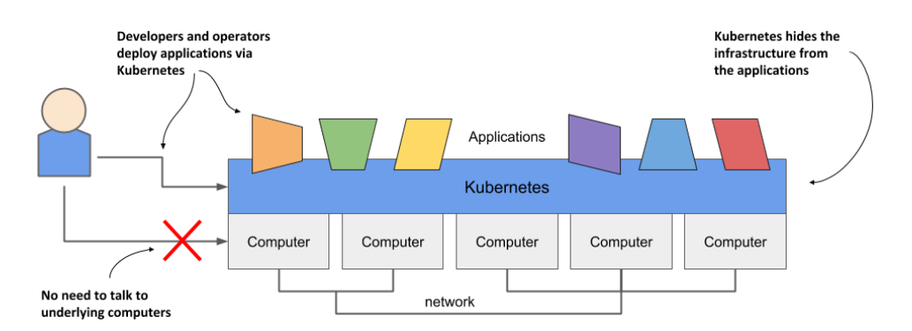
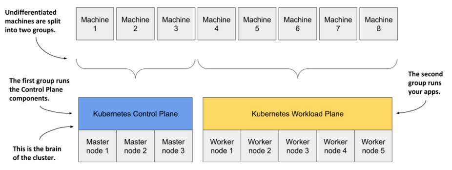
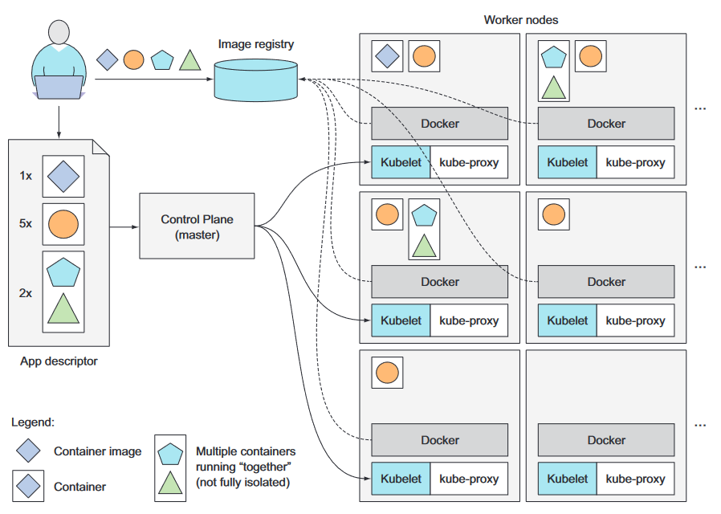
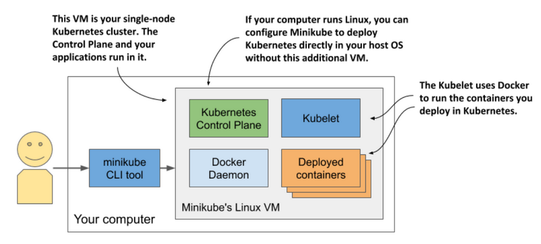
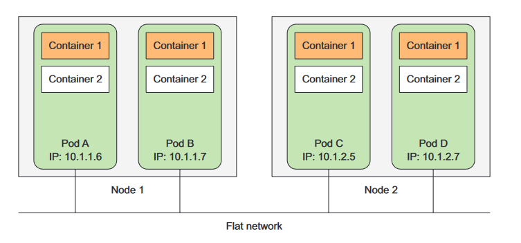
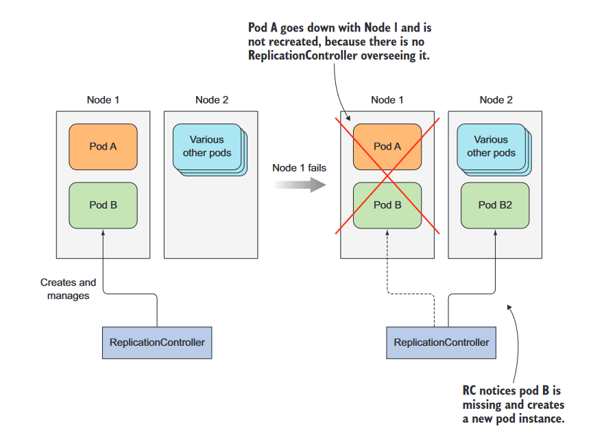
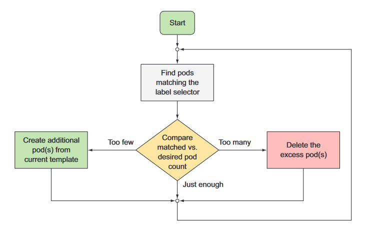

# Projecte final de grau superior d'ASIX


---
---
## Introducció a Kubernetes 

### Què és Kubernetes?  
  
Kubernetes és un sistema de software de codi obert que serveix per a automatitzar la implementació i gestió de sistemes d'aplicació complexos a gran escala, compostos per processos informàtics que s'executen en contenidors.  
  
Kubernetes permet executar aplicacions de software en milers de nodes d'ordinadors  
com si tots aquests nodes fossin un únic i enorme ordinador, fent que s'abstregui la infraestructura subjacent i fent que se simplifiqui el desenvolupament, el desplegament i la gestió.

### Quin és l'origen de Kubernetes?  
  
Kubernetes va ser desenvolupat originalment per Google. Google sempre ha executat  
aplicacions en contenidors. Ja en 2014, van dir que llançaven 2.000 milions de contenidors cada setmana. Això és més de 3.000 contenidors per segon, i la xifra és molt  
més gran avui. Fan funcionar aquests contenidors en milers d'ordinadors distribuïts a través  
dotzenes de centres de dades a tot el món.  
  
Per això van crear Kubernetes, perquè va sorgir la necessitat d'automatitzar totes les tasques d'arrencada, manteniment i actualització de containers a escala massiva.

### D'on ve el nom Kubernetes?  
  
La paraula Kubernetes ve del grec i en aquest idioma vol dir timoner, o sigui, la persona que porta el timó d'un vaixell. Un timoner no és necessàriament el mateix que un  
capità. Un capità és responsable del vaixell, mentre que el timoner és qui el dirigeix.  
  
El timoner manté el curs del vaixell, porta a terme les ordres donades pel capità i li reporta el transcurs de la nau. Kubernetes dirigeix les aplicacions i reporta sobre el seu estat mentre tu - el capità - decideix on vol que vagi el sistema.


### Què fa Kubernetes?  
  
Podem visualitzar Kubernetes com un sistema construït en capes, amb cada capa més alta abstraient la complexitat que es troba en els nivells més baixos.  
  
A la seva base, Kubernetes reuneix les màquines físiques o virtuals individuals en un clúster utilitzant una xarxa compartida per comunicar-se entre cada ordinador. Aquest clúster de Kubernetes és la plataforma física on es configuren tots els components, capacitats i càrregues de treball de Kubernetes.


 
Quan es desplega una aplicació a través de Kubernetes, automàticament ell selecciona  
un ordinador per a cada component de l'aplicació, el desplega i li permet trobar i comunicar-se fàcilment amb altres components de l'aplicació i amb altres aplicacions, entre altres funcions.

### Com s'estructura Kubernetes?

Cada ordinador que treballa sota el clúster de Kubernetes se'l coneix com a node.

Depenent de la funció que hagi de complir el node, aquest es pot categoritzar en Master node o en Worker Node.

* Els Master nodes treballen en el que es coneix com a "Control Plane". "El Control Plane" és el component de Kubernetes que actua com a porta d'entrada i com a cervell del clúster, exposant l'API de Kubernetes per a usuaris i clients, comprovant la salut d'altres nodes, decidint com dividir i assignar processos i orquestrant comunicació entre altres components.
Els Master nodes actuen com el punt principal de contacte amb el clúster i són els responsables de la major part de la lògica centralitzada que proporciona Kubernetes.

* Els Worker nodes treballen en el que es coneix com a "Workload Plane". "El Workload Plane" és el component de Kubernetes que executa les aplicacions en contenidors i és l'encarregat d'executar, controlar i proporcionar serveis a les aplicacions



#### Quins són els components dels nodes?

Tots dos tipus de nodes es caracteritzen per tenir una série de components que els permet complir el seu treball. Hi han components únics per tipus de node:

+ Components d’un Master Node
  + etcd -> Servei que s’encarrega d’emmagatzemar informació del clúster accesible per tots els nodes
  + kube-apiserver -> Server API que permet a l’usuari les càrregues de treball de Kubernetes entre altres funcions
  + kube-controller-manager -> Servei que regula l’estat del clúster, gestiona els cicles de vida de les càrregues de treball i realitza tasques rutinàries
  + kube-schedluer -> Servei que s’encarrega d’assignar càrregues de treball a nodes especifics

+ Components d’un Worker Node
  + containers runtime -> Software per treballar amb containers, com per exemple Docker
  + kubelet -> Servei que fa de punt de contacte del node amb el Control Plane
  + kube-proxy-> Servei que s’encarrega d’enrutar peticions del containers a la xarxa interna del node

### Com es llança una aplicació en Kubernetes?

Per llançar una aplicació en Kubernetes, primer has de containeritzar la teva aplicació i crear una imatge. Després de crear la imatge, has de donar-li a l'API de Kubernetes una descripció de la teva aplicació.

La descripció inclou informació com la imatge o imatges dels components de la teva aplicació, com es relacionen entre ells, quantes còpies ha d'haver-hi, quin nom han de tenir, etc.

Quan l'API processa la descripció de l'aplicació, Kubernetes crea objectes a partir de les imatges de contenidors i els assigna als nodes de treball disponibles.



---

## Interactuar amb Kubernetes

### Què és Minikube?

Minikube és una distribució reduïda de Kubernetes que et permet muntar un clúster amb només un node.

Per fer aquest projecte, he utilitzat Minikube, ja que és l'eina més fàcil per aprendre a interactuar amb l'API sense haver de disposar de moltes màquines físiques o virtuals configurades.

Per instal·lar Minikube, es pot fer servir l'enllaç a la següent pàgina web: <https://k8s-docs.netlify.app/en/docs/tasks/tools/install-minikube/>

Després d'instal·lar Minikube, el podem iniciar amb la següent comanda:

`minikube start`

```
a184311jq@PC:~/kubernetes$ minikube start
😄  minikube v1.30.1 en Ubuntu 23.04 (vbox/amd64)
✨  Controlador docker seleccionado automáticamente
📌  Using Docker driver with root privileges
👍  Starting control plane node minikube in cluster minikube
🚜  Pulling base image ...
🔥  Creando docker container (CPUs=2, Memory=2200MB) ...
🐳  Preparando Kubernetes v1.26.3 en Docker 23.0.2...
    ▪ Generando certificados y llaves
    ▪ Iniciando plano de control
    ▪ Configurando reglas RBAC...
🔗  Configurando CNI bridge CNI ...
    ▪ Using image gcr.io/k8s-minikube/storage-provisioner:v5
🔎  Verifying Kubernetes components...
🌟  Complementos habilitados: default-storageclass, storage-provisioner
🏄  Done! kubectl is now configured to use "minikube" cluster and "default" namespace by default
```

Un cop està Minikube en marxa, podem fer la següent comanda per veure el seu estat:

`minikube status`

```
a184311jq@PC:~/kubernetes$ minikube status
minikube
type: Control Plane
host: Running
kubelet: Running
apiserver: Running
kubeconfig: Configured

```

Per veure el llistat de nodes del clúster (*de moment només és un*) i de les seves IPs hem d'utilitzar la següent comanda:

`minikube nodes list`

Si només volem veure la IP del node, hem d'utilitzar la següent comanda:

`minikube ip`

```
a184311jq@PC:~/kubernetes$ minikube node list
minikube	192.168.49.2
a184311jq@PC:~/kubernetes$ minikube ip
192.168.49.2
```

Finalment, aturem Minikube amb la següent comanda:

`minikube stop`

```
a184311jq@PC:~/kubernetes$ minikube stop
✋  Stopping node "minikube"  ...
🛑  Apagando "minikube" mediante SSH...
🛑  1 node stopped.
```

El que fa en realitat Minikube és muntar una màquina virtual que actuarà com únic node i on són tots els components d'un Master node, tot i que també actua com un Worker node.



Però amb Minikube també podem crear un clúster amb dos nodes o més nodes amb la següent comanda:

`minikube start --node 2`

```
a184311jq@PC~/kubernetes$ minikube start --nodes 2
😄  minikube v1.30.1 en Ubuntu 23.04 (vbox/amd64)
✨  Controlador docker seleccionado automáticamente
📌  Using Docker driver with root privileges
👍  Starting control plane node minikube in cluster minikube
🚜  Pulling base image ...
🔥  Creando docker container (CPUs=2, Memory=2200MB) ...
🐳  Preparando Kubernetes v1.26.3 en Docker 23.0.2...
    ▪ Generando certificados y llaves
    ▪ Iniciando plano de control
    ▪ Configurando reglas RBAC...
🔗  Configurando CNI CNI ...
    ▪ Using image gcr.io/k8s-minikube/storage-provisioner:v5
🔎  Verifying Kubernetes components...
🌟  Complementos habilitados: storage-provisioner, default-storageclass

👍  Starting worker node minikube-m02 in cluster minikube
🚜  Pulling base image ...
🔥  Creando docker container (CPUs=2, Memory=2200MB) ...

🧯  Docker is nearly out of disk space, which may cause deployments to fail! (88% of capacity). You can pass '--force' to skip this check.
💡  Suggestion: 

    Try one or more of the following to free up space on the device:
    
    1. Run "docker system prune" to remove unused Docker data (optionally with "-a")
    2. Increase the storage allocated to Docker for Desktop by clicking on:
    Docker icon > Preferences > Resources > Disk Image Size
    3. Run "minikube ssh -- docker system prune" if using the Docker container runtime
🍿  Related issue: https://github.com/kubernetes/minikube/issues/9024

🌐  Se han encontrado las siguientes opciones de red:
    ▪ NO_PROXY=192.168.49.2
🐳  Preparando Kubernetes v1.26.3 en Docker 23.0.2...
    ▪ env NO_PROXY=192.168.49.2
🔎  Verifying Kubernetes components...
🏄  Done! kubectl is now configured to use "minikube" cluster and "default" namespace by default
```

Si executem la comanda `minikube node list` per veure els nodes, ara podem veure que apareixen dues entrades. També executem la comanda `minikube status` per veure l'estat dels dos nodes. 

```
a184311jq@PC:~/kubernetes$ minikube node list
minikube	192.168.49.2
minikube-m02	192.168.49.3
a184311jq@PC:~/kubernetes$ minikube status
minikube
type: Control Plane
host: Running
kubelet: Running
apiserver: Running
kubeconfig: Configured

minikube-m02
type: Worker
host: Running
kubelet: Running

```
Aturem el clúster:

```
a184311jq@PC:~/kubernetes$ minikube stop
✋  Stopping node "minikube"  ...
🛑  Apagando "minikube" mediante SSH...
✋  Stopping node "minikube-m02"  ...
🛑  Apagando "minikube-m02" mediante SSH...
🛑  2 nodes stopped.
```

---

### Què és `kubectl` ?

'kubectl' és l'eina de CLI que ofereix Kubernetes perquè els usuaris interactuïn amb el Control Plane mitjançant l'API de Kubernetes.

Per instal·lar 'kubectl', es pot fer servir l'enllaç a la següent pàgina web: <https://kubernetes.io/docs/tasks/tools/install-kubectl-linux/>

Un cop instal·lat i amb el clúster de Minikube encès, podem començar a interactuar amb l'API.

Si volem obtenir informació del clúster, hem d'executar la següent comanda:

`kubectl cluster-info`

```
a184311jq@a184311jq-VirtualBox:~$ kubectl cluster-info
Kubernetes control plane is running at https://192.168.49.2:8443
CoreDNS is running at https://192.168.49.2:8443/api/v1/namespaces/kube-system/services/kube-dns:dns/proxy

To further debug and diagnose cluster problems, use 'kubectl cluster-info dump'.
```

Si volem llistar els nodes del clúster, hem d'executar la següent comanda:

`kubectl get nodes`

```
a184311jq@a184311jq-VirtualBox:~$ kubectl get nodes
NAME   	STATUS   ROLES       	AGE	VERSION
minikube   Ready	control-plane   168m   v1.26.3
```

Totes les ordres per interactuar amb l'API de Kubernetes es poden fer per CLI, però per crear objectes de l'API es pot fer també mitjançant arxius de configuració.

Per aquest treball, tots els exemples s'han fet mitjançant arxius YAML.


#### Quines són les característiques d’un arxiu YAML d’objecte API Kubernetes?

L’API de Kubernetes disposa de diversos objectes que veurem a continuació, i els arxius YAML per cada objecte tenen petites diferencien entre ells, però tots tenen certes parts en comú:

+ apiVersion:   -> Camp on es diu la versió de l'API de Kubernetes utilitzada per l’objecte
+ kind: -> Camp on es diu el tipus d’objecte de l'API de Kubernetes
+ metadata: -> Camp on s’especifica el nom de l’objecte, etiquetes, anotacions, etc.
+ spec: -> Camp on es diu la imatge del container, els ports, etc.

Més endavant veurem els diferents arxius per cada objecte.

---

### Quins són els objectes de l'API de Kubernetes?

Mentre que els containers són el mecanisme utilitzat per desplegar aplicacions, Kubernetes utilitza capes addicionals d'abstracció sobre la interfície del container per proporcionar escala, resiliència i funcions de gestió del cicle de vida. En lloc de gestionar els contenidors directament, l'usuari defineix i interactua amb instàncies composades de diversos objectes de Kubernetes.

Per poder treballar amb els diferents objectes de l'API de Kubernetes, he fet servir una app sencilla en Javascript que la seva funció és retornar el hostname de la màquina que està corrent l'aplicació.

> [app.js](./arxius/app/app-base/app.js)

```
const http = require('http');
const os = require('os');
console.log("App server starting...");
var handler = function(request, response) {
console.log("Received request from " + request.connection.remoteAddress);
response.writeHead(200);
response.end("You've hit " + os.hostname() + "\n");
};
var www = http.createServer(handler);
www.listen(8080);
```

---

#### Què és un Pod?

El pod és la unitat més petita amb la que treballa Kubernetes. Kubernetes no treballa amb els containers de forma directa, sinó que treballa sobre els pods que és on s'estan executant els containers.

Les característiques d'un pod són que sempre tenen un o més containers, mai poden estar compartits entre nodes i cada un es comporta com una màquina separada amb la seva pròpia IP, hostname, processos, etc. executant una única aplicació.



Normalment els pods no es creen de forma manual, però per posar un exemple, crearé un pod que corri la següent [app](./arxius/app/app-base/app.js).

Primer de tot, hem de crear l'arxiu YAML del pod.

> [app-manual.yaml](./arxius/pods/app-manual.yaml)

```
apiVersion: v1
kind: Pod
metadata:
  name: app-manual
spec:
  containers:
  - image: jordiiqb/app
    name: app
    ports:
    - containerPort: 8080
      protocol: TCP
```

En aquest cas, en l'apartat `kind: ` hem d'especificar que volem crear un objecte de tipus `Pod`.

A l'apartat `metadata` especifiquem quin serà el nom que tindrà el nostre objecte en el clúster. En aquest cas es dirà `app-manual`.

I per últim, en el subapartat `containers: ` dins l'apartat `spec: ` especifiquem d'on treu la imatge del container, quin nom tindrà el container i per quin port escoltarà.

Per crear l'objecte pod en Kubernetes, utiltzem la següent comanda:

`kubectl create -f app-manual.yaml`

```
a184311jq@a184311jq-VirtualBox:~/kubernetes/arxius/pods$ kubectl create -f app-manual.yaml 
pod/app-manual created
```

Alternativament, també podem utilitzar aquesta comanda per crear l'objecte si no està creat o per modificar-ho si ho està.


```
a184311jq@a184311jq-VirtualBox:~/kubernetes/arxius/pods$ kubectl apply -f app-manual.yaml 
pod/app-manual created
```

Per poder llistar els pods, utiltzem la següent comanda:

`kubectl get pods`

```
a184311jq@a184311jq-VirtualBox:~/kubernetes/arxius/pods$ kubectl get pods
NAME         READY   STATUS    RESTARTS   AGE
app-manual   1/1     Running   0          84s
```

Per llistar-los amb més informació, utiltzem la següent comanda:

`kubectl get pods -o wide`

```
a184311jq@a184311jq-VirtualBox:~/kubernetes/arxius/pods$ kubectl get pods -o wide
NAME         READY   STATUS    RESTARTS   AGE    IP           NODE       NOMINATED NODE   READINESS GATES
app-manual   1/1     Running   0          106s   10.244.0.8   minikube   <none>           <none>
```

Amb l'última ordre podem veure la IP asignada del pod. Si ataquem a la IP (10.244.0.8) en el port 8080, ens hauria de retornar el nom de host del pod, però si ho executem veiem que no es així:

```
a184311jq@a184311jq-VirtualBox:~/kubernetes/arxius/pods$ curl -s 10.244.0.8:8080


```

Els pods només son visibles dins del propi clúster de Kubernetes. Per poder accedir al recurs dins d'un pod, en aquest cas o podem fer de la següent forma:

`kubectl port-forward app-manual 8888:8080`

```
a184311jq@a184311jq-VirtualBox:~/kubernetes/arxius/pods$ kubectl port-forward app-manual 8888:8080
Forwarding from 127.0.0.1:8888 -> 8080
Forwarding from [::1]:8888 -> 8080
Handling connection for 8888


```
```
a184311jq@a184311jq-VirtualBox:~/kubernetes/arxius/pods$ curl -s localhost:8888
You've hit app-manual
```

La comanda `kubectl port-forward` enruta el tràfic del port 8080 del pod a un port de la nostra màquina, en aquest cas el 8888.

Per eliminar un pod, utilitzem la següent comanda:

`kubectl delete pod app-manual`

```
a184311jq@a184311jq-VirtualBox:~/kubernetes/arxius/pods$ kubectl delete pod app-manual
pod "app-manual" deleted
```

---

#### Què són un Replication Controller i un Replica Set?

Els pods són objectes que es van pensar per ser efímers. A vegades un pod pot fallar degut a un bug o un problema propi del node i no és viable haber d'estar aixecant manualment tots el pods del clúster.

Per això es van idear els Replication Controllers. Aquests són uns objectes de l'API que donats una definició s'encarreguen de mantenir un número de pods corrent en tot moment.
Si un pod deixa de funcionar, el Replica Controller s'encarregarà d'aixecar un de nou.



Veiem un exemple d'arxiu YAML del Replication Controller.

> [app-rc.yaml](./arxius/replication_controllers/app-rc.yaml)

```
apiVersion: v1
kind: ReplicationController
metadata:
  name: app-rc
spec:
  replicas: 3
  selector:
    app: app
  template:
    metadata:
      labels:
        app: app
    spec:
      containers:
      - name : app
        image: jordiiqb/app
        ports:
        - containerPort: 8080
```

En aquest arxiu veiem tres subapartats nous de l'apartat `spec:` :

+ `replicas: `
+ `selector: `
+ `template: `

En el subapartat `replicas: ` especifiquem quantes còpies del pod volem.
En el subapartat `selector: ` especifiquem quin es l'etiqueta per la cual revisarà els pods concrets.
En el subapartat `template: ` especifiquem com serà la "plantilla" dels nostres pods.

Aquest és el loop que faría el meu Replication Controller "app-rc" per verificar si hi han 3 pods "app":



Per crear l'objecte Replication Controller en Kubernetes, utiltzem la següent comanda:

``
```
```


---

#### Què és un Service?

---

#### Què és un Deployment?
